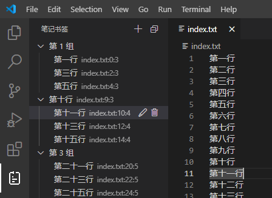

# 项目说明

笔记书签，可以自由组织的树形结构的书签。

## 基本功能

- 添加分组：只有书签文字，不指向具体的文件位置。
- 添加书签：在编辑器窗口中点击右键，在上下文菜单中选择【添加笔记书签】。
- 删除书签：带子节点的书签在删除时需要确认。
- 调整书签组织结构：在树形结构的书签列表中通过鼠标拖拽来进行调整。
- 修改书签文字
- 跳转到书签位置：打开指定的文件，并定位到书签位置。
- 自动修复书签：当跳转到书签位置时，会自动检查该处内容是否已改变，如果跟当初不一致则在附近查找并调整书签的位置。

## 关于鼠标拖拽操作

受 VSCode extension 中 TreeView API 的限制，实现鼠标拖拽功能时并不能完全按照需要来实现，
比如不支持在拖拽时通过 SHIFT/CTRL 键来调整拖拽行为，不支持拖拽过程中的动态反馈等。

这给设计用鼠标拖拽调整书签结构的的操作带来了一定障碍，本插件尽量设计使得操作逻辑符合直觉，
但难免有些细节并不是特别自然，需要一些适应过程。

- 在任何一个节点（source）上都可以启动 drag 操作。
- 可以在任何一个节点（target）上进行 drop，也可以 drop 到空白处。
- 当 target 与 source 是兄弟关系时，source 会被移动到 target 的位置，target 则向前或向后让位。
- 当 target 是 source 的下游节点时，操作无效。
- 当 target 即是 source 本身时，如果其相邻的上一个兄弟节点没有子节点，则本节点将成为其子节点，否则操作无效。
- 当 target 与 source 是其它关系时，source 将被移动到 target 所有子节点的最后位置。
- 特别地，当 target 为空白位置时，source 将被移动到根节点列表的最后位置。

# 参考资料

[VS Code API](https://code.visualstudio.com/api/references/vscode-api)

[Guide: Tree View API](https://code.visualstudio.com/api/extension-guides/tree-view)

[Contribution Points](https://code.visualstudio.com/api/references/contribution-points#contributes.viewsContainers)

[Icon Listing](https://code.visualstudio.com/api/references/icons-in-labels#icon-listing)
